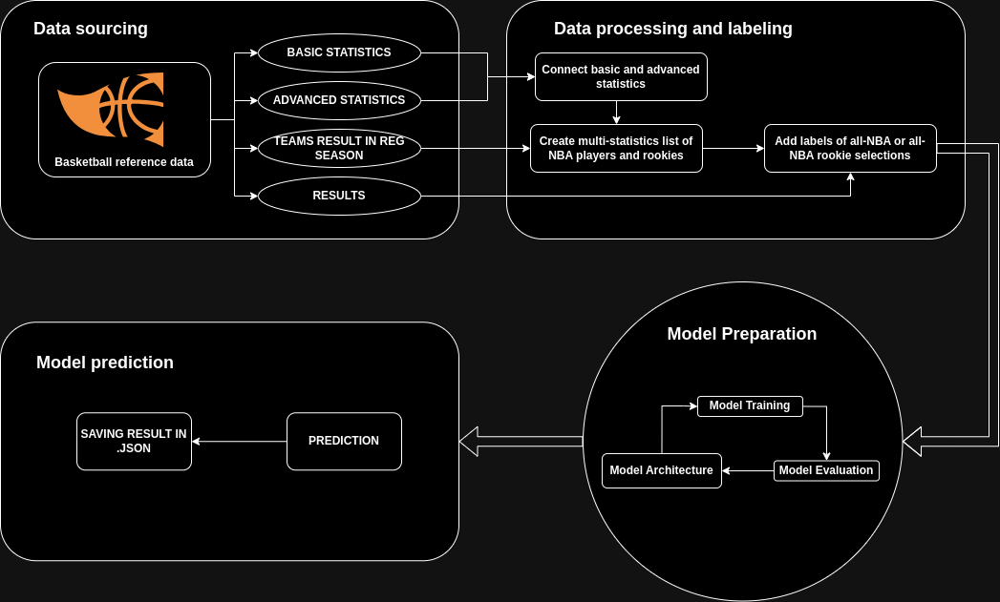

# NBA AWARDS PREDICTOR

## Table of Contents
- [Main goal](#main-goal)
- [Installation](#installation)
- [Usage](#usage)
- [Configuration](#configuration)
- [Making predictions](#making-predictions)
- [Results](#results)
- [Data source](#data-source)
- [Documentation](#documentation)


## Main goal
The goal of the project is to use statistical data to predict the list of players who will receive awards (first, second and third all-nba team, first and second rookie all-nba team) for the regular season. 

## Installation

Clone repository:
```bash
git clone https://github.com/2acholsk1/nba_awards_predictor.git
cd nba_award_predictor
```

After that, you need to setup virtual environment, Makefile commands will help you:
```bash
make setup-venv
```
Remember to activate venv with command: `source bin/activate`.

Then, you can easily build and install package by using:
```bash
make setup
```

## Usage 

If you want to start working with models, firstly use command:
```bash
make data-work
```
which will prepare, format and then label the data.
The next step is to deal with models, you can train them independently, with commands and given configurations in config file:
- **Model #1: all-NBA 1st, 2nd and 3rd teams:**
```bash
make model-all-nba
```
- **Model #2: rookie all-NBA 1st and  2nd teams:**
```bash
make model-rookie
```

## Configuration

Configuration file `prediction_config.yaml` contain:
- Data range settings (start_year, end_year).
- Model parameter file names for training (params_name, params_name_rook).
- Model file names for training (model_name, model_name_rook).
- Prediction model names (prediction_model, prediciton_model_rook).
- Number of iterations for parameter search (n_iterations, n_iterations_rook).
- List of columns to remove at the beginning (drop_cols).
- Paramenters for RandomizedSearchCV in all-NBA model training.
- Lists of features to remove before training the model (drop_features, drop_features_rook).
- Paramenters for RandomizedSearchCV in rookie all-NBA model training.

You can copy this file and create own `.yaml`file for building your models.

## Making predictions

The program has a model prepared for prediction all-NBA 1st, 2nd, 3rd teams and rookie all-NBA 1st, 2nd teams 
To run the prediction, use command and specify the path to save :
```bash
NBA_predict your/path/to/save/file
```

## Results

The output from the script is saved as a `.json` file in a format like the following:
```json
{
  "first all-nba team": [
    "Shai Gilgeous-Alexander",
    "Giannis Antetokounmpo",
    "Luka Dončić",
    "Jalen Brunson",
    "Nikola Jokić"
  ],
  "second all-nba team": [
    "Jayson Tatum",
    "Anthony Edwards",
    "Anthony Davis",
    "Jaylen Brown",
    "Kawhi Leonard"
  ],
  "third all-nba team": [
    "Stephen Curry",
    "Domantas Sabonis",
    "Devin Booker",
    "Zion Williamson",
    "LeBron James"
  ],
  "first rookie all-nba team": [
    "Victor Wembanyama",
    "Chet Holmgren",
    "Brandon Miller",
    "Jaime Jaquez Jr.",
    "Brandin Podziemski"
  ],
  "second rookie all-nba team": [
    "Ausar Thompson",
    "Amen Thompson",
    "Dereck Lively II",
    "Trayce Jackson-Davis",
    "Keyonte George"
  ]
}

```

## Data source

Data downloaded from Basketball-reference [link](https://www.basketball-reference.com/)

Statistics of players playing in the NBA from the 1999/2000 season to 2023/2024. This range of data was adopted because of the assurance of a sufficiently large dataset that is 25 seasons and a historical reason without coverage: This was the season in which Kobe Bryant won his first championship ring.

Description of shortcuts in data farames [link](https://github.com/2acholsk1/nba_awards_predictor/tree/main/data/desc_short.md)

## Documentation

Overall view on program workflow:


The documentation is focused on showing what happens in the files in question, which are also described using docstrings. After command `make setup` you can use this scripts with specific commands described also below.

- **data_work/preparing.py:**

The script is used to work on data, such as importing data, deleting columns and rows, creating a rookie list, and removing asterisks from players' names.

```bash
data_prepare
```

- **data_work/preparing_teams:**

The script is used to prepare team data by extracting relevant information about teams and their performance.

```bash
data_team_prepare
```

- **data_work/formating.py:**

This script is designed to format score data from Basketball Reference. It reads CSV files containing scores for All-NBA teams and rookies, removes unnecessary columns, adjusts season formatting and writes the data to new CSV files.

```bash
data_format
```

- **data_work/linking.py:**

The script is used to label player data, determining whether players were selected to the All-NBA team or the rookie team in a given season. In addition, it also adds a feature related to the team's regular season score.

```bash
data_link
```

- **model_work/parameters_search.py:**

The script is used to automatically find optimal parameters for the XGBoost model using Randomized Search. It uses linked data with All-NBA results from different seasons to train and evaluate the model.

```bash
data_params_search
```

- **model_work/train.py:**

The script is dedicated to train an All-NBA model using the XGBoost algorithm. It uses combined data from different seasons, encodes categorical columns and trains the model based on the best parameters found earlier.

```bash
data_train
```

- **model_work/feature_important**

The script is used to generate a graph showing the importance of the features of the trained model. It uses the model loaded from the .pkl file and sample data to display which features were most important to the model during the learning process.

```bash
data_feature_important
```

- **model_rookie_work/parameters_search.py:**

The script is used to automatically find optimal parameters for the XGBoost model using Randomized Search. It uses linked data with All-NBA results from different seasons to train and evaluate the model. But for rookie model.

```bash
data_params_search_rookie
```

- **model_rookie_work/train.py:**

The script is dedicated to train a rookie All-NBA model using the XGBoost algorithm. It uses combined data from different seasons, encodes categorical columns and trains the model based on the best parameters found earlier. But for rookie model.

```bash
data_train_rookie
```

- **model_rookie_work/feature_important**

The script is used to generate a graph showing the importance of the features of the trained model. It uses the model loaded from the .pkl file and sample data to display which features were most important to the model during the learning process. But for rookie model.

```bash
data_feature_important_rookie
```

## Bugs & Feature Requests

Please report bugs and request features using the [Issue Tracker](https://github.com/2acholsk1/nba_awards_predictor/issues).
